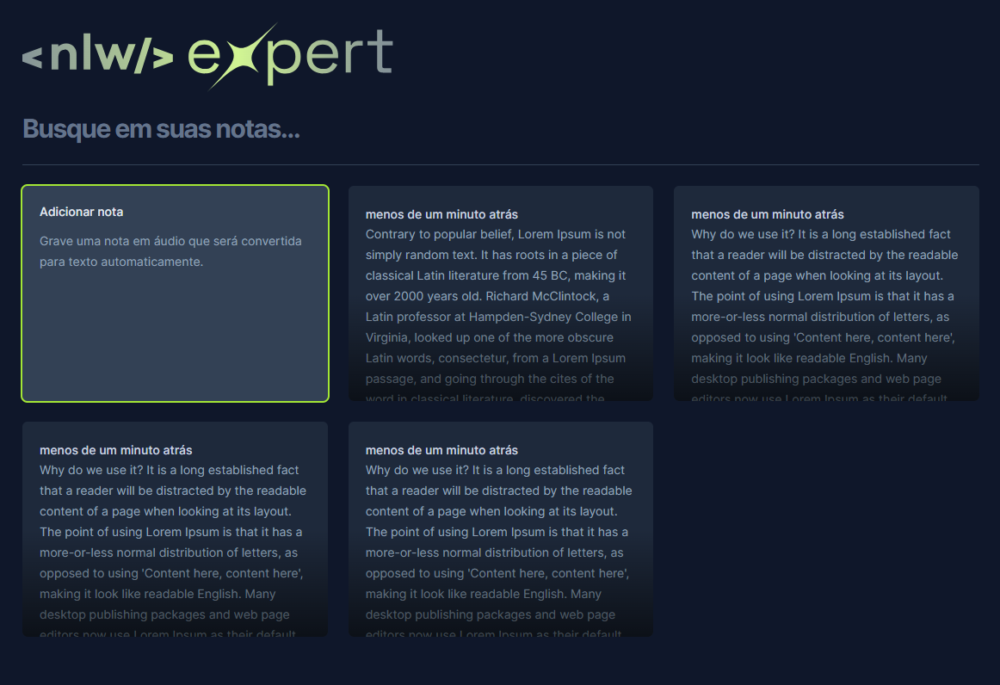

<h1 align="center"> Clone Expert Notes </h1>

 Uma aplicação prática e responsiva para criar e gerenciar suas notas. 

  

## 🚀 Tecnologias

Este projeto foi desenvolvido com as seguintes tecnologias:

- TypeScript
- React
- TailWind CSS
- Vite
- HTML
- Radix
- Git e Github

## 💻 Sobre o Projeto

O Clene Expert Notes foi desenvolvildo durante o NLW EXPERT da RocketSeat. É uma plataforma versátil para organização de notas, oferecendo inclusive a funcionalidade de gravação de voz para uma experiência mais dinâmica e eficiente.

- [Acesse o projeto online]()

Feito com ❤️ por Marcos Anjos
